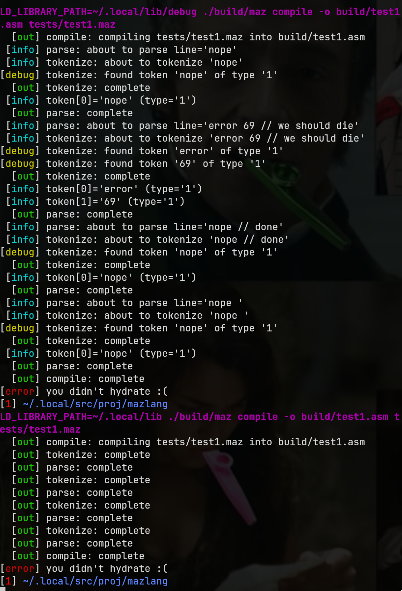

# libprintfmt

wrapper for printf functions in C.

supports more file descriptors than only stdout and stderr. puts everything on stdout with known prefixes and colours

overrides fprintf, dprintf, and fprintf.
check the header file for other wrapper functions.

compile with `-DVERBOSITY=5` for highest trace level. file descriptor numbers lower than verbosity gets filtered away.

for user builds, i suggest -DVERBOSITY=2 since this includes stderr, but not anything above it.

## build
```sh
: ${PREFIX:=${HOME:?}/.local}
mkdir -p "${PREFIX}/lib/debug"
cc -DVERBOSITY=2 -fPIC -shared -o ${PREFIX}/lib/libprintfmt.so printfd.c
cc -DVERBOSITY=5 -fPIC -shared -o ${PREFIX}/lib/debug/libprintfmt.so printfd.c
```

## usage

compile your programs with `-L$(PREFIX)/lib -lprintfmt`, and make sure to `#include <printfd.h>` in them

run your programs with `LD_LIBRARY_PATH=` set to either `${PREFIX}/lib/debug` or `${PREFIX}/lib` or whatever

you may want to place the `libprintfmt.so` on a well-known path, or link it statically. up to you tbh

## showcase



